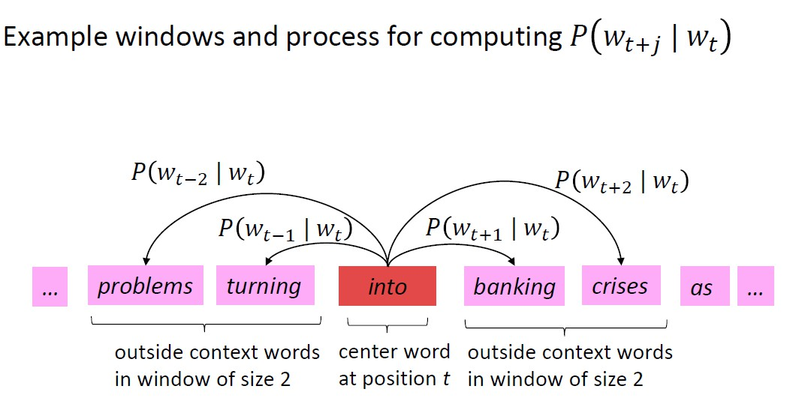

# Lecture1

## Distributional semantics

    A word's meaning is given by the words that **frequently appear close-by**.

- type: uses and meaning of the word
- token: a instance of the word

## Word vectors

- usually 300 dimensional
- similar words have similar vectors

## Word2vec algorithm

- Overview
  - a large corpus of text (400000 words)
  - each position _t_ in the text has a center word _c_ and context (outside) word _o_
  - use the **similarity of the word vectors** for _c_ and _o_ to **calculate the probability** of _o_ given _c_ (vice versa)
  - **keep adjusting the word vectors** to maximize this probability
  - we use 2 vectors per word _w_:
    - $v_w$ when _w_ is a center word
    - $u_w$ when _w_ is a context word

- Math!

  - 对于一个句子，从头到尾每个单词都会做一次中心词，根据步长计算其与上下文词的关联度，之后只要全部乘起来即可，我们可以将其写成函数：
$$
    Likelihood = L(\theta) = \prod_{t=1}^T \prod_{-m \leq j \leq m, j \ne 0} P(w_{t+j}|w_t;\theta)
$$
  - 不过我们更喜欢换一种写法，也就是写成损失函数(objective function / loss function)的形式( _T_ 为句子长度)：
$$
    J(\theta) = -\frac{1}{T}log L(\theta) = -\frac{1}{T}\sum_{t=1}^T \sum_{-m \leq j \leq m, j \ne 0} logP(w_{t+j}|w_t;\theta)
$$
  - 这样最小化损失函数就可以最大化概率了  
    Minimizing objective function $\Leftrightarrow$ Maximizing predictive accuracy

  - 最重要的$P(w_{t+j}|w_t;\theta)$怎么计算呢？  
For a center word_c_ and a context word _o_:
$$
    P(o|c) = \frac{exp(u_o^T v_c)}{\sum_{w\in V} exp(u_w^T v_c)}
$$
这个公式有几点需要注意的：
    - 我们倾向用两个向量的点积来表示它们的相似程度
    - exp是为了都是正数
    - 分母求和方便归一化计算概率分布
    - 这实际上是一个softmax函数，把实数域映射到了(0,1)
  - So now with _d_-dimensional vectors and _V_-many words, we have a long vector called $\theta$ that contains all parameters:
$$
\theta =
\begin{bmatrix}
v_{aardvark}\\
\dots\\
v_{zebra}\\
u_{aardvark}\\
\dots\\
u_{zebra}
\end{bmatrix} \in \mathbb{R}^{2dV}
$$
    We are going to optimize these parameters by **gradients**!  
    It's all about calculous and derivatives(其实挺简单的，但我真的会忘，所以还是记一下):
$$
    \frac{\partial}{\partial v_c}log \frac{exp(u_o^T v_c)}{\sum_{w=1}^V exp(u_w^T v_c)}
    = \frac{\partial}{\partial v_c}log(exp(u_o^T v_c)) - \frac{\partial}{\partial v_c}log \sum_{w=1}^V exp(u_w^T v_c) \\
    = u_o - \frac{1}{\sum_{w=1}^V exp(u_w^T v_c)} · \frac{\partial}{\partial v_c}\sum_{w=1}^V exp(u_w^T v_c) \\
    = u_o - \frac{1}{\sum_{w=1}^V exp(u_w^T v_c)} · \sum_{x=1}^V exp(u_x^T v_c)u_x \\
    = u_o - \sum_{x=1}^V P(x|c)u_x \\
    = observed - expected
$$
    This is the derivatives for the center vector parameters, we also need to calculate outside vector parameters(they are similar).
  - 实际中我们当然要用梯度下降来找最优解，不过参数太多直接做梯度下降效率很低，所以就要用 **随机梯度下降(Stochastic Gradient Descent)**.
    相比之下，梯度下降相当于每次对整个矩阵求一次偏导，一次性更新所有参数，而随机梯度下降则是 **一个参数一个参数**(or a small batch like 32 per time)更新，这样效率会高一些
  - **"Bag of words" model** 我们没有考虑一个词是包含很多种含义的，而是完全 **当成一个词来看**，所以模型其实比较粗糙，但最后效果还不错？  
    比如一个词 _pike_，它有很多种含义，从结果上来看，它的vector实际是这样的：$v_{pike} = \alpha_1 v_{pike_1} + \alpha_2 v_{pike2} + \alpha_3 v_{pike_3} + \dots$ $ (\alpha_1 = \frac{f_1}{f_1+f_2+f_3+\dots}, \ for \ frequency \ f)$  
- Optimization
  - 直接算 _P(o|c)_ 也就是softmax函数计算量还是很大的，所以可以用 **negative sampling** 来简化目标函数：
$$
    J(\theta) = \frac{1}{T} \sum_{t=1}^T J_t(\theta)\\
    J_t(\theta) = log \ \sigma(u_o^T v_c) + \sum_{i=1}^k \mathbb{E}_{j \sim P(w)} [log \ \sigma (-u_j^T v_c)]\\
    \sigma(x) = \frac{1}{1 + e ^(-x)}
$$
    $J_t(\theta)$的前半部分仍然是计算两个词的相关程度，而后半部分则是计算中心词和其他噪声的相关性，要尽量减小这部分的影响  
    改用 **sigmoid(logistic)** 函数，这样一些非常常见的虚词导致的极大值不会对全局有太大影响
    这样我们也可以写出损失函数：
$$
    J_{neg-sample}(u_o,v_c,U) = -log \ \sigma(u_o^T v_c) - \sum_{k \in \{K \ sampled \ indices\}} log \ \sigma (-u_k^T v_c)
$$
    We randomly(_P(w)_) take **k negative samples**. What we need to do is to maximize probability that **real outside word** appears and minimize probability that **random words** appear around center word.  
    $P(w)=U(w)^{3/4}/Z$ 其中U(w)是单词出现的次数除以总单词数，这样可以使分布更平均一些，避免极大极小值的干扰
- Co-occurrence
  - 我们也可以用 _co-occurrence matrix_ 来表示单词的相关度. 对于单词i和j，i行j列就记录两个词在一个window中的次数  
    当然这个矩阵肯定巨大无比，而且是一个稀疏矩阵，所以我们考虑压缩它，怎么压缩呢？这又要用到奇异值分解SVD，已知$X = U \Sigma V^T$，就从$\Sigma$入手，先变成方阵，再去掉一些奇异值，U和V对应压缩，可以把这个矩阵变得小一些，更容易计算
    当然同时还要对a, the这类常见词的次数做一些限制，比如取log会设一个上限，这样效果会好得多
- GloVe
  - 综合了以上二者的优点，效果更好，但现在作者认为效果更好实际上是因为训练集更优质（用的wikipedia）
- Evaluation
  - intrinsic
    - 类比 _Analogy_，比如man-woman, king-queen，一般这种有对应关系的词向量相减后的值都比较相近
    - 直接看相似度，看两个词向量的相似程度是否与人类直觉一致
    - evaluate on a specific subtask, fast to compute but may not be helpful for real task
  - extrinsic
    - evaluate on real tasks(_named entity recognition_), slow to compute but always helpful
