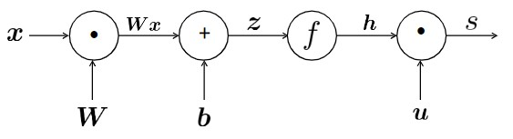
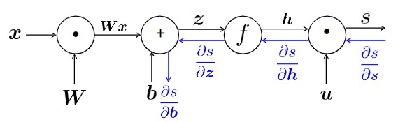
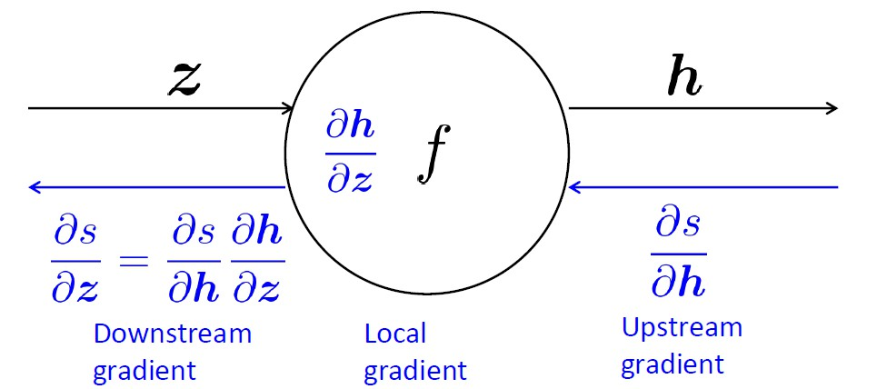
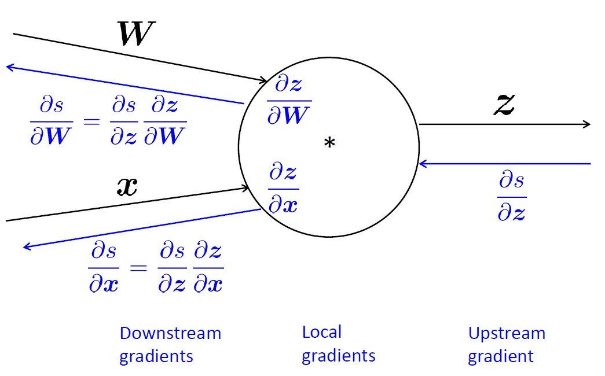
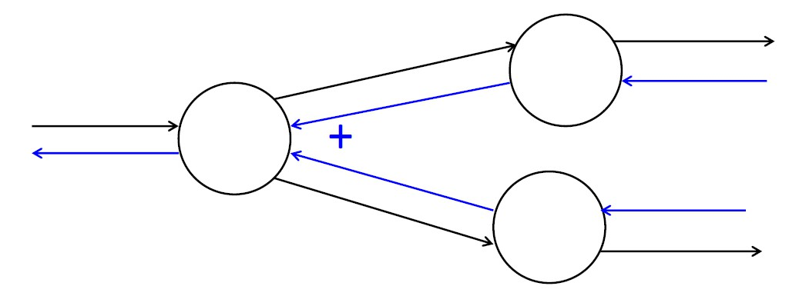

# Lecture 2

## Named Entity Recognition(NER)

- find and classify names(person, location, date...) in text
- idea: classify **each** words in its **context window** of neighboring words
  - 比如window长度为2，那就是一共5个单词，把这5个单词向量合并成一个向量直接放进网络里
  - 自然我们要训练人名、地名、日期各自的网络，这个网络最后的output需要是一个0到1的实数，表明中心词是人名、地名、日期的概率
- 网络的架构是这样的：

    1. $\bold{x} = [\bold{x}_{museums} + \bold{x}_{in} + \bold{x}_{paris} + \bold{x}_{are} + \bold{x}_{amazing}]$ (inputs)
    2. $\bold{h} = f(\bold{W}x + \bold{b}) $ (_f_ = sigmoid, ReLU... )
    3. $\bold{s} = \bold{u}^T \bold{h}$
    4. $J_t(\theta) = \sigma(s) = \frac{1}{1 + e^{-s}}$ (output)

## Matrix calculus

- 方便起见，上述网络的最后一层sigmoid函数暂时先不考虑，只看前三步
- $h = f(z)$:

$$
    h_i = f(z_i)\\
    \bold{h},\bold{z} \in \mathbb{R}^n\\
    (\frac{\partial h}{\partial z})_{ij} = \frac{\partial h_i}{\partial z_j} = \frac{\partial}{\partial z_j} f(z_i)\\\\[4pt]
    \frac{\partial \bold{h}}{\partial \bold{z}} =
    \begin{bmatrix}
        f'(z_1) & \dots & 0 \\
        \vdots & \ddots & \vdots \\
        0 & \dots & f'(z_n)
    \end{bmatrix}
    = diag(f'(z))
$$

- $z = \bold{Wx} + \bold{b}$:

$$
    \frac{\partial}{\partial \bold{x}} (\bold{Wx} + \bold{b}) = \bold{W}\\\\[4pt]
    \frac{\partial}{\partial \bold{b}} (\bold{Wx} + \bold{b}) = I
$$

- $\bold{s} = \bold{u}^T \bold{h}$ (result is row vector):
  
$$
    (\frac{\partial s}{\partial u})_{ij} = \frac{\partial s}{\partial u_j} \\
    \frac{\partial s}{\partial u} = \bold{h}^T \\
    \frac{\partial s}{\partial h} = \bold{u}^T
$$

- Break up first and apply the chain rule ($\odot$表示对应位置逐元素相乘，结果仍为向量):

$$
    \frac{\partial s}{\partial b} = \frac{\partial s}{\partial h} \frac{\partial h}{\partial z} \frac{\partial z}{\partial b} \\\\[4pt]
    = u^T \ diag(f'(z)) \ I \\
    = u^T \odot f'(z)
$$

- 当我们再去计算$\frac{\partial s}{\partial W}$时，就会发现$\frac{\partial s}{\partial h} \frac{\partial h}{\partial z}$是重复的，所以我们令$\frac{\partial s}{\partial h} \frac{\partial h}{\partial z} = \delta$，就不用重复计算了，$\delta$又叫**error signal**  
但是还有一个问题，s是一个实数，W是一个矩阵，理论上求导会得到一个非常长的向量，这在应用上是不好做的，所以我们这里讨巧一下，把结果整理成一个矩阵，这种做法叫做**shape convention**，表示为了应用方便而改变了结果的排列(leave pure math)，注意这里$\delta$取转置也是同理:

$$
    \frac{\partial s}{\partial W} =
    \begin{bmatrix}
        \frac{\partial s}{\partial W_{11}} & \dots & \frac{\partial s}{\partial W_{1m}} \\
        \vdots & \ddots & \vdots \\
        \frac{\partial s}{\partial W_{n1}} & \dots & \frac{\partial s}{\partial W_{nm}} \\
    \end{bmatrix}
    \\\\[4pt]
    = \bold{\delta}^T \bold{x}^T
$$

## Back Propagation

- Forward Propagation:

- Back Propagation:

  - **[Downstream gradient] = [Local gradient] $\times$ [Upstream gradient]**
  - 1 in 1 out:
  
  - _n_ ins 1 out:
  
  - 1 in _n_ outs:
  
  - 最后回到起点得到的值是什么意思呢？简单来说这个值的大小反映了如果微调这个input，output的变化情况，**值越大，说明这个input对output的影响就越大**

- Back-Prop in General Computational Graph

  - 计算的时候我们自然不希望重复，所以正向传播的时候就要使用**拓扑排序**(topological sort)，反向传播的时候只要反过来就可以了
  - 实际应用时，函数和其导数还是要自己写的，其他的都可以交给计算机解决

- Checking(Numeric Gradient)
  
  - 可以用以下方法检查梯度算的对不对(准确但速度较慢):

$$
    f'(x) \approx \frac{f(x + h) - f(x - h)}{2h}\\\\[4pt]
    for \ small \ h(\approx 10^{-4})
$$
