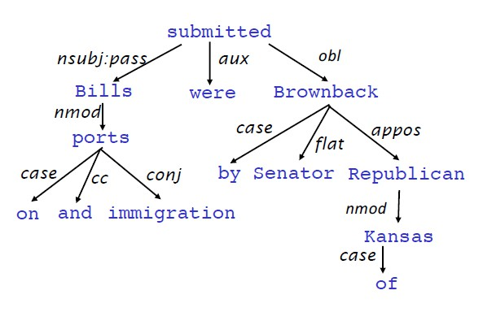
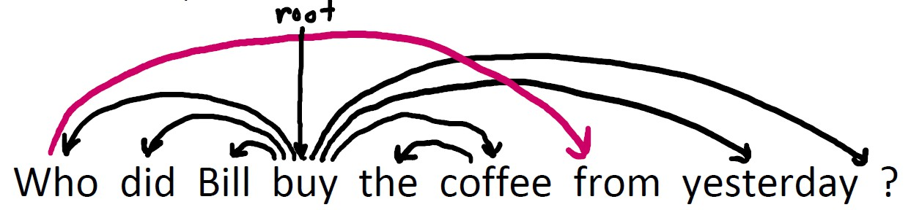
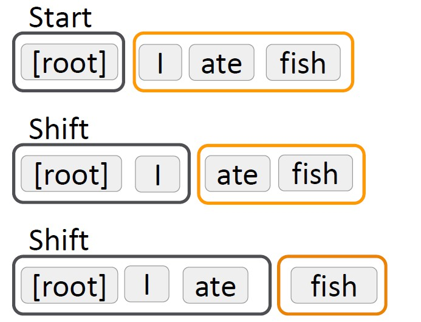
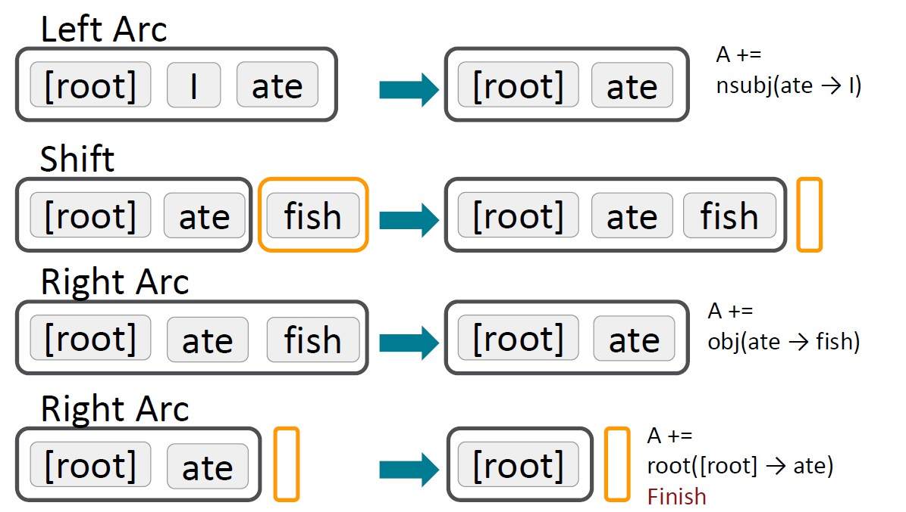
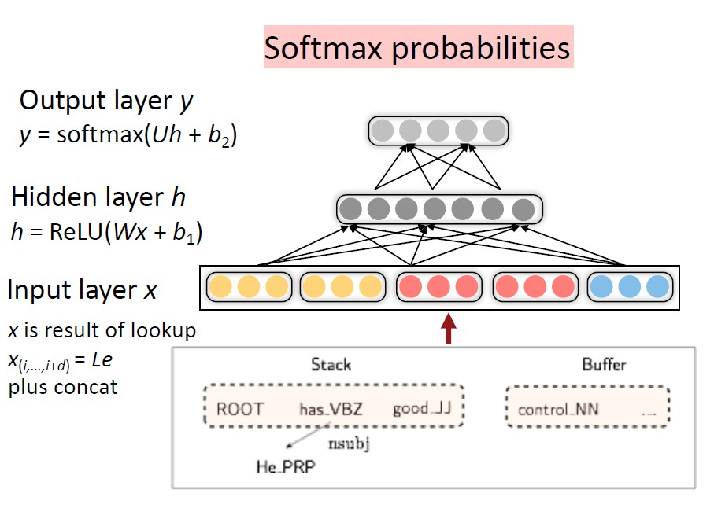
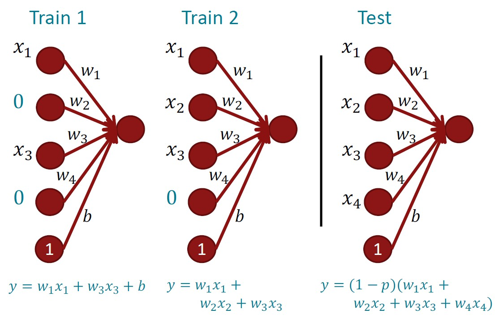

# Lecture 3

## Syntactic Structure

- Constituency = phrase structure grammar = context-free grammar
  - _table_ is a noun
  - _the table_ is a noun phrase
  - _on the table_ is a preposition noun phrase
  - ...

- Dependency Structure
  - Dependency structure shows which word **depend on** (modify, attach to, or are arguments of) which other words.
  - Humans communicate complex ideas by **composing words together into bigger units** to convey complex meanings
  - A model needs to work out what modifies **attach to** what
  - Languages have ambiguities:
    - prepositional phrase attachment ambiguity
        >Cops kill man with knife
    - Coordination scope ambiguity
        >Shuttle veteran and longtime NASA executive Fred Gregory ...
    - adjective/adverbial modifier ambiguity
        >Students get first hand job experience
    - verb phrase attachment ambiguity
        >Mutilated body washes up on Rio beach to be used for Olympics beach volleyball

## Dependency Grammar and Dependency Structure

- Dependency syntax postulates that syntactic structure consists of relations between lexical items, normally **binary asymmetric relations** (“arrows”) called **dependencies**  
箭头一般是被修饰词指向修饰词(from head to dependent)(约定俗成)，并且表明具体的种类，这样可以构建一棵树(因为显然没有环). 对每一个句子我们会人为设置一个root表示起点

- Universal Dependencies Tree
  - <https://universaldependencies.org/>
  - 相当于一个benchmark

- Dependency Conditioning Preference
  - bilexical affinities (discussion -> issues)
  - dependency distance (most dependencies are between nearby words)
  - intervening material (dependencies rarely span intervening verbs or punctuation)
  - valency of words (how many dependents on which side are usual for a head)

- Dependency Parsing
  - A sentence is parsed by choosing for **each word** what other word (including ROOT) it is a dependent of
  - **only one** word is a dependent of ROOT
  - no cycles
  - **Projective Parse**: There are **no crossing dependency arcs** when the words are laid out in their linear order, with all arcs above the words  
    here is a non-projective structure:

  - 接下来我们会默认所有的句子都是projective parse

## Methods of Dependency Parsing

- Greedy transition-based parsing
  - a stack $\sigma$ which starts with ROOT
  - a buffer $\beta$ which starts with the input sentence
  - a set of dependency arcs _A_ which starts off empty
  - a set of actions

- Basic transition-based dependency parser
  - Start: $\sigma = [ROOT], \beta = w_1, \dots , w_n, A = \empty$
  - Shift: $\sigma, w_i | \beta, A \rightarrow \sigma | w_i, \beta, A$
  - Left-Arc: $\sigma | w_i | w_j, \beta, A \rightarrow \sigma | w_j, \beta, A \bigcup  \{r(w_j, w_i)\} $
  - Right-Arc: $\sigma | w_i | w_j, \beta, A \rightarrow \sigma | w_i, \beta, A \bigcup  \{r(w_i, w_j)\} $
  - Finish: $\sigma = [w], \beta = \empty$

- Arc-standard transition-based parser
  - Analysis of "I ate fish":

  - This example makes the 'correct' next transition in each step. But a parser has to work this out by exploring and inferring. So we need the power of **machine learning**.
  - Each action is predicted by a discriminative classifier over each legal move —— it's really fast with high accuracy
  - Conventional Feature Representation:  
  parser可以学习的feature是非常多的，所以通常会选择1到3个feature组合起来学习
  - Evaluation of dependency parsing: (labeled) dependency accuracy  
    一般指标有两个，一个是看箭头标的两个单词对不对UAS(unlabeled attachment score)，一个是看这个关系种类标的对不对LAS(labeled attachment score)

- Graph-based dependency parsers
  - 对每个head，计算所有可能是它的dependent的单词，把概率最大的作为它的dependent
  - good but slow

- Handling non-projectivity
  - don't do anything
  - use a postprocessor to resolve nonprojective links
  - move to a parsing mechanism that does not use or require any constraints on projectivity

## Indicator Features Revisited

- categorical features
  - sparse (vectors dimension = 1e6 ~ 1e7)
  - incomplete (some have feature A while others don't)
  - expensive to compute (consume 95% of time)

- neural approach
  - learn a dense and compact feature representation (dimension = ~ 1000)
  - distributed representation:
    - similar words have close vectors
    - **tags and labels** are also represented as vectors (which means similar labels have close vectors)
    - extracting tokens & vector representations from configuration
  - deep learning classifiers are non-linear classifiers
    - traditional classifiers like logistic regression, SVMs and softmax only give **linear decision boundaries**
    - neural networks can use multiple layers to learn much more complex **nonlinear decision boundaries**
    - hidden layers like ReLU are used
    - 简单来说，隐藏层通过改变本来不能线性划分的input所在的空间，使之能够被线性划分
    - architecture:

## a bit more about neural network

- Regularization
  - $\lambda \sum_k \theta_k^2$
  - classic view: regularization works to prevent **overfitting** when we have a lot of features
  - now: regularization **produces model that generalization well**
    - we don't care that the model overfit on the training data, even though they are hugely overfit (as long as the model perform well on test data)
    - 直观上说，相当于对所有的参数有一个惩罚，只有这个参数真的有用，它才可以不为0，也就是它的作用可以抵消这个惩罚

- Dropout
  - **Feature co-adaptation**: a feature is useful only in the presence of particular other features
  - Preventing feature co-adaptation = Good regularization method
  - Training time: at each instance of evaluation (in online SGD-training), randomly set ~50% (p%) of the inputs to each neuron to 0 (**drop half or more of the inputs**)
  - Test time: halve(1-p) the model weights and no other dropout
  - In a single layer: A kind of middle-ground between Naïve Bayes (where all feature weights are set independently) and logistic regression models (where weights are set in the context of all others)
  - 每次随机丢掉一半的输入相当于一个强制的regularization，因为用上述的方法往往不能有效抑制参数变大，所以dropout的方法可以更有效地使参数维持在一个更合理的区间中，如今非常常用

- Non-linearities
  - logistic(sigmoid): $f(z) = \frac{1}{1 + e^{-z}}$
  - tanh: $f(z) = tanh(z) = \frac{e^z - e^{-z}}{e^z + e^{-z}} = 2 sigmoid(2z) - 1$
  - hard tanh
  - ReLU: $rect(z) = max(z,0)$

- Parameter Initialization
  - 0矩阵的对称性质可能导致一系列问题
  - initialize **all other weights** ~ U(-r,r)
  - Xavier initialization ($n_{in}$ is previous layer size and $n_{out}$ is next layer size):

$$
  Var(W_i) = \frac{2}{n_{in}+n_{out}}
$$

- Optimizers
  - Learning rate:
    - starts around 0.001 and try powers of 10
    - start higher and halve it every k epochs (passes through full data, **shuffled** or sampled)
    - ...
  - other adaptive optimizers like Adagrad, Adam...
