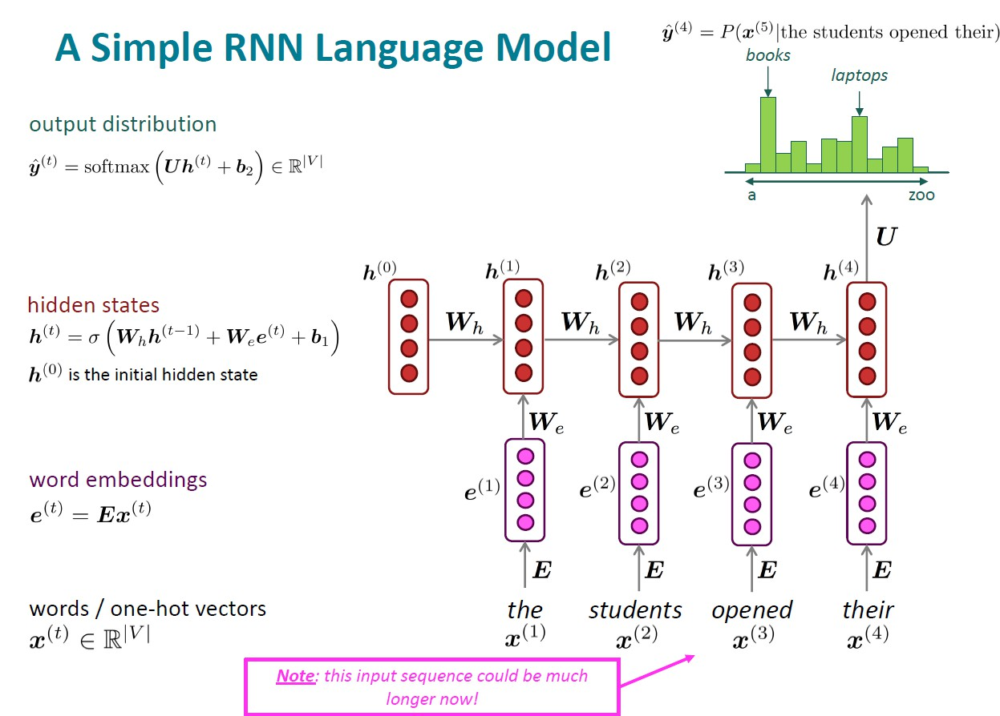
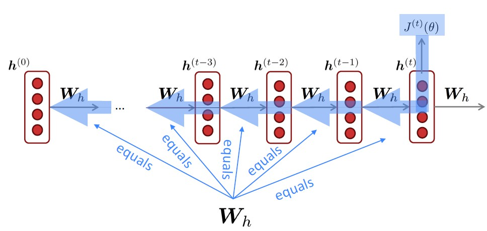
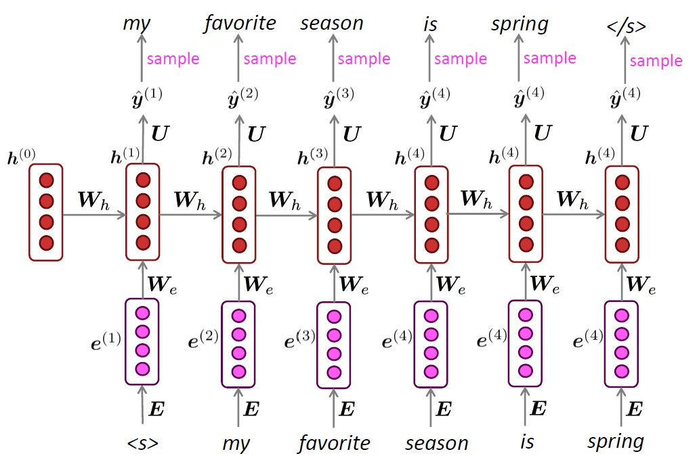
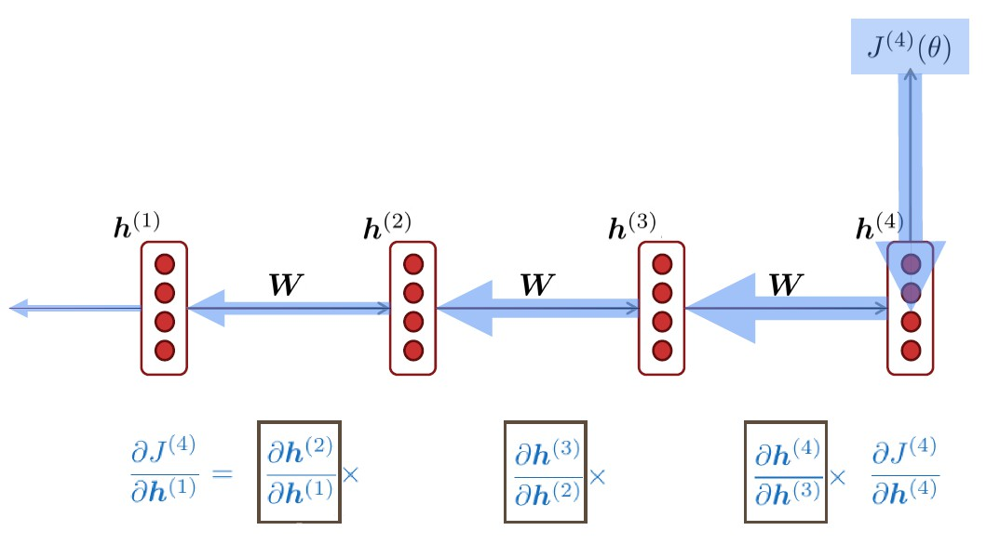
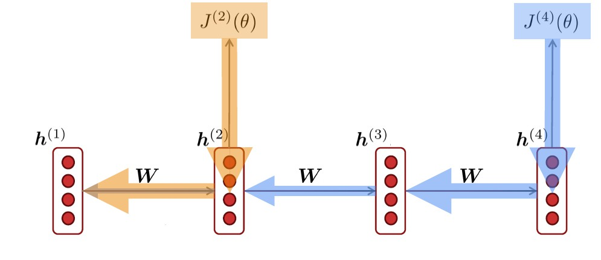

# Lecture 4

## Language Modeling

- Language Modeling is the task of **predicting what word comes next**
- given a sequence of word $x^{(1)},x^{(2)},\dots,x^{(t)}$, compute the probability distribution of the next word $x^{(t+1)}$: $P(x^{(t+1)} | x^{(t)},\dots,x^{(1)})$
- it's also a system that assigns a probability to a piece of text:  
$$
    P(x^{(1)},\dots,x^{(T)}) = P(x^{(1)}) \times P(x^{(2)} | x^{(1)}) \times \dots \times P(x^{(T)} | x^{(T-1)},\dots,x^{(1)}) \\
    = \prod_{t=1}^T P(x^{(t)} | x^{(t-1)}, \dots, x^{(1)})
$$
- n-gram Language Model
  - an **n-gram** is a chunk of _n_ consecutive words
  - idea: collect statistics about **how frequent** different n-grams are and use these to predict next word
  - **Markov assumption**: $x^{(t+1)}$ depends only on the preceding n-1 words
$$
    P(x^{(t+1)} | x^{(t)}, \dots, x^{(1)}) = P(x^{(t+1)} | x^{(t)}, \dots, x^{(t-n+2)})\\\\[4pt]
    = \frac{P(x^{(t+1)}, \dots, x^{(t-n+2)})}{P(x^{(t)}, \dots, x^{(t-n+2)})}\\\\[4pt]
    \approx \frac{count(x^{(t+1)}, \dots, x^{(t-n+2)})}{count(x^{(t)}, \dots, x^{(t-n+2)})}
$$

  - suppose a 4-gram language model (discard earlier context):
$$
    P(\omega | students \ opened \ their) = \frac{count(students \ opened \ their \ \omega)}{count(students \ opened \ their)}
$$
  - problem 1: $\omega$ has probability 0  
    solution: add small $\delta$ to the count for every $\omega$ (_smoothing_)
  - problem 2: "students opened their" never occurred in data  
    solution: condition on "opened their" (_backoff_)
  - storage problem: need to store count for all n-grams, so we can't have n bigger than 5
  - it turns out to be grammatical but incoherent

- Window-based Neural Language Model
  - use a fixed-window of _n_ and discard earlier context
  - improvements:
    - no sparsity problem
    - don't need to store all observed n-grams
  - remaining problems:
    - window is too small and can never be large enough (越大的window需要越多的参数，再大的window也会落下一些单词)
    - the word order in the window is ignored (window里的每个单词都用的是不同的权重，单词与单词间没有任何联系)

## Recurrent Neural Network (RNN)

- core idea: apply the same weights _W_ **repeatedly**
- architecture:

  ($h^{(0)}$ 初始值为0)
- 也就是说，在hidden states使用同一个矩阵依次对每个单词进行更新，这样就可以保证每个单词都能被用上
- advantages:
  - can process **any length** input
  - model **size doesn't increase** for longer input context
  - computation for step _t_ can use information from many steps back (in theory)
  - **symmetry** in how inputs are processed
- disadvantages:
  - recurrent computation is **slow**
  - difficult to access information from many steps back (in practice)
- training
  - get a big corpus of text
  - feed into RNN-LM, compute output distribution $\hat{y}^{(t)}$ for every step _t_ (predict _each word_)
  - loss function (cross-entropy交叉熵):
$$
  J^{(t)}(\theta) = CE(y^{(t)}, \hat{y}^{(t)}) = - \sum_{\omega \in V}y_{\omega}^{(t)} log \hat{y}_{\omega}^{(t)} = -log \hat{y}_{x_{t+1}}^{(t)}
$$  
overall loss:
$$
  J(\theta) = \frac{1}{T}\sum_{t=1}^T J^{(t)}(\theta) = \frac{1}{T} \sum_{t=1}^T -log \hat{y}_{x_{t+1}}^{(t)}
$$
it's called "Teacher forcing"  
大概意思是说，这种训练方式相当于对每个单词算loss然后都加起来，这样如果模型生成的句子和训练集完全不一样那误差就会很大，那么我们就会要求模型重新去预测这个句子，有点像老师在强迫你去学习训练集的句子一样
  - 当然直接用整个数据集训练是不现实的，通常的方法是切割成小段喂给模型，比如说一次喂32个等长的句子
  - Backpropagation
    - 注意我们已知$\frac{d}{dt}f(x(t),y(t)) = \frac{\partial f}{\partial x}\frac{dx}{dt} + \frac{\partial f}{\partial y}\frac{dy}{dt} $  
    那么我们就有:
$$
  \frac{\partial J^{(t)}}{\partial W_h} = \sum_{i=1}^t \frac{\partial J^{(t)}}{\partial W_h} |_{(i)} \frac{\partial W_h | _{(i)}}{\partial W_h} \\
  = \sum_{i=1}^t \frac{\partial J^{(t)}}{\partial W_h} |_{(i)}
$$

    - In practice, often “**truncated**” after ~20 timesteps for training efficiency reasons

- generating
  - just like an n-gram Language Model, you can generate text by **repeated sampling**, sampled output becomes next step's input (don't forget the &lt;s&gt; and &lt;/s&gt;):

- evaluating
  - Perplexity: if you get a perplexity of 53, that means how uncertain you are of the next word is equivalent to the uncertainty of that you're tossing a 53-sided dice and it coming up as a 1 (a simple interpretation):
$$
  perplexity = \prod_{t=1}^T (\frac{1}{P_{LM}(x^{(t+1)} | x^{(t)}, \dots, x^{(1)})})^{1/T}\\
  = \prod_{t=1}^T (\frac{1}{\hat{y}^{(t)}_{x_{t+1}}}) ^{1/T} = exp(\frac{1}{T} \sum_{t=1}^T -log \hat{y}_{x_{t+1}}^{(t)}) = exp(J(\theta))
$$

- other RNN uses
  - part-of-speech tagging, named entity recognition
  - sentiment classification
    - instead of using final hidden state, taking element-wise max or mean of all hidden states is better
  - question answering
  - speech recognition

- problems
  - **vanishing gradients**

    - because of the chain rule, the derivatives could be really small after so many multiplication
    - a linear case (if $\sigma(x) = x$):
$$
  \frac{\partial h^{(t)}}{\partial h^{(t-1)}} = diag (\sigma' (W_h h^{((t-1))} + W_x x^{(t)} + b_1))W_h = W_h
$$
    consider the gradient of the loss $J^{(i)}(\theta) $ on step _i_, with respect to the hidden state $h^{(j)}$ on some previous step _j_, let _l_ = _i_ - _j_ :
$$
  \frac{\partial J^{(i)}(\theta)}{\partial h^{(j)}} = \frac{\partial J^{(i)}(\theta)}{\partial h^{(i)}} \prod_{j < t \leq i} \frac{\partial h^{(t)}}{\partial h^{(t-1)}}\\
  = \frac{\partial J^{(i)}(\theta)}{\partial h^{(i)}} \prod_{j < t \leq i} W_h = = \frac{\partial J^{(i)}(\theta)}{\partial h^{(i)}} W_h^l
$$
    if $W_h$ is "small", then this term gets exponentially problematic as l becomes larger
    - non-linear case is pretty much the same thing
    - **Gradient signal from far away is lost** because it’s much smaller than gradient signal from close-by. So, model weights are updated only with respect to **near effects, not long-term effects**

    Simple RNN-LM is unable to predict similar long-distance dependencies
  - **exploding gradients**
    - the SGD update becomes too big if the gradients become too big (can't converge)
    - solution:
      - gradient clipping: set a **threshold** and if the norm of the gradient is greater than the threshold, scale it down before applying SGD update
      - it's like taking a step in the same direction, but a smaller step
