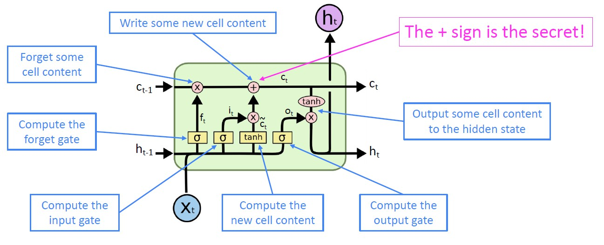
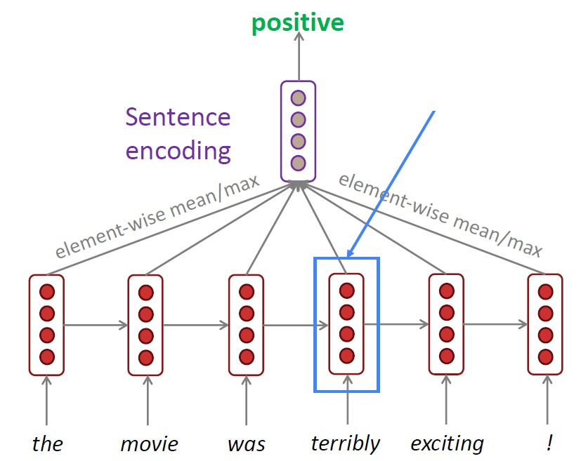
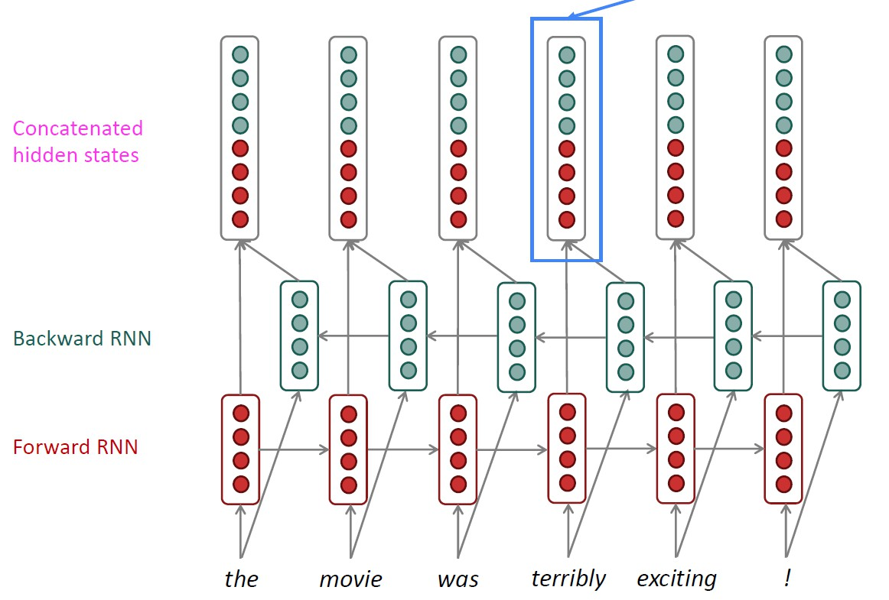
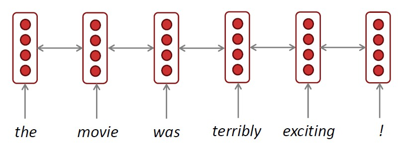
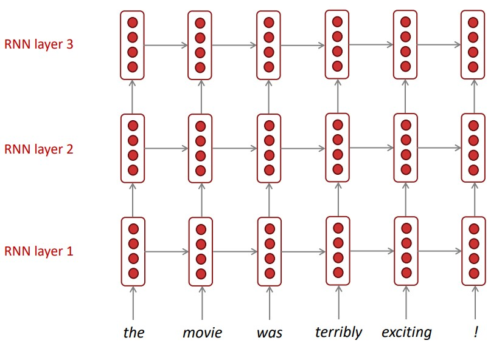
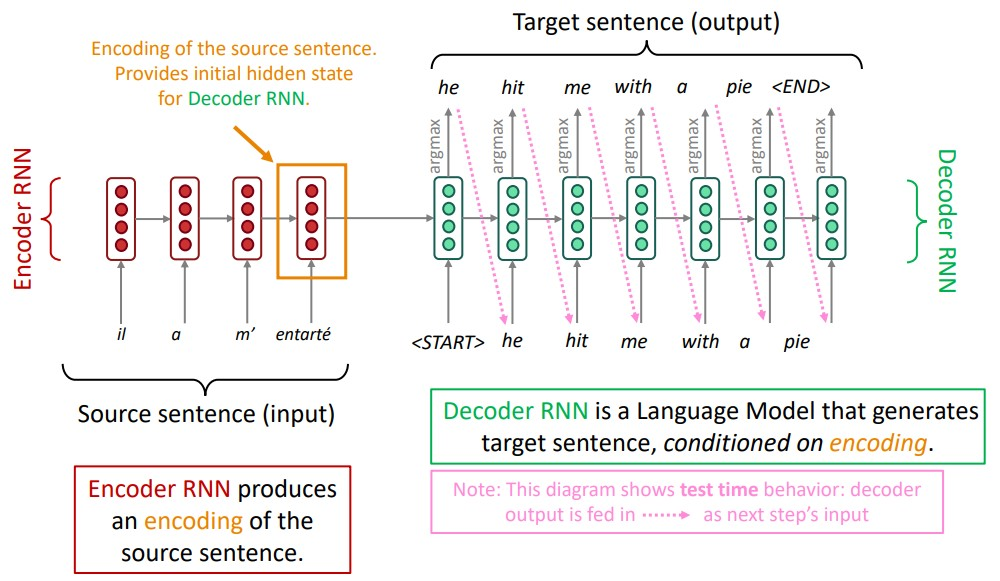
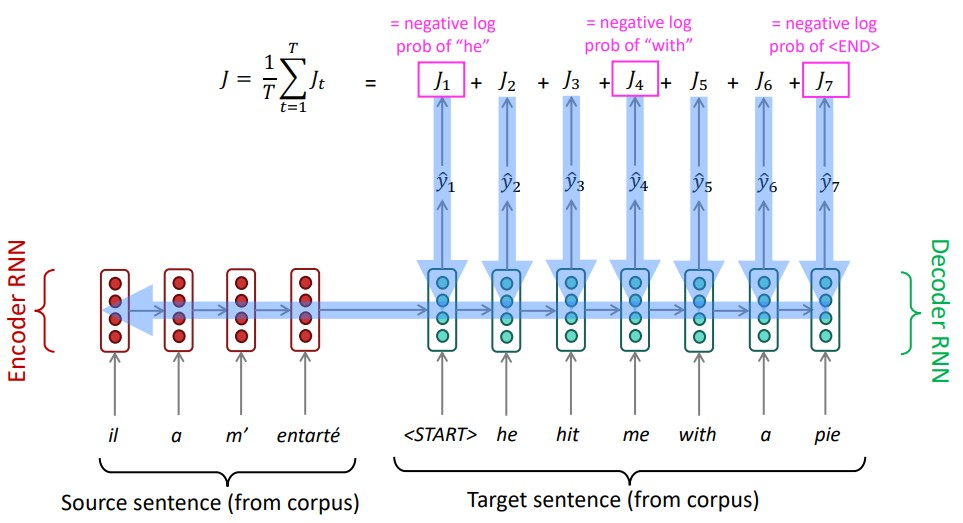
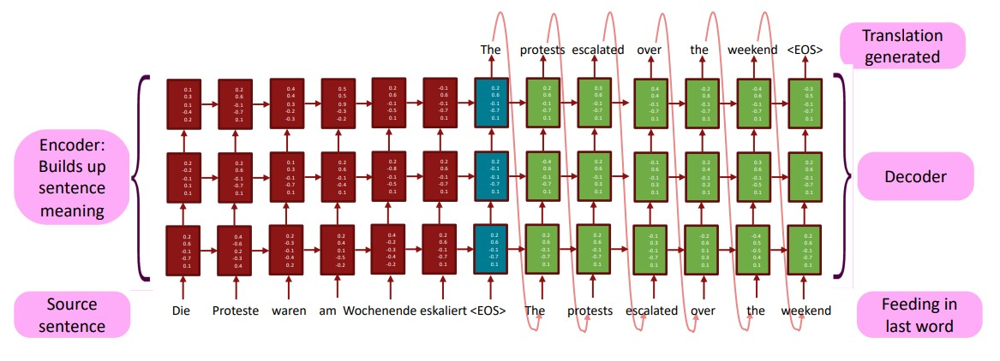
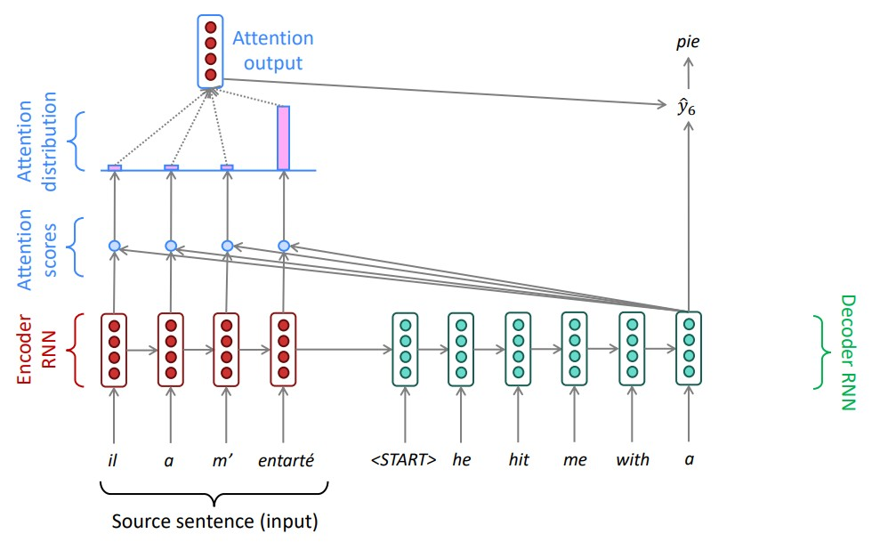

# Lecture 5

## LSTM

- Long Short-Term Memory RNNs
  - 它的意思是long (short term)不是(long short) term，short term memory表示短时记忆，这里的long是相对于普通RNN而言的
- On step _t_, there is a **hidden state** $h^{(t)}$ and a **cell state** $c^{(t)}$
  - both are vectors length _n_
  - the cell stores long-term information (which is more similar to the hidden state in simple RNNs)
  - the LSTM can _read, erase, and write_ information from cell
- The selection of which information is erased/written/read is controlled by three corresponding **gates**
  - the gates are also vectors length _n_
  - on each timestep, each element of the gates can be open(1), closed(0), or somewhere in-between
  - the gates' value is computed base on the current context
- We have a sequence of inputs $x^{(t)}$, and we will compute a sequence of hidden states $h^{(t)}$ and cell state $c^{(t)}$. On timestep _t_:
$$
    \bold{f}^{(t)} = \sigma(\bold{W}_f \bold{h}^{(t-1)} + \bold{U}_f \bold{x}^{(t)} + \bold{b}_f)\\
    \bold{i}^{(t)} = \sigma(\bold{W}_i \bold{h}^{(t-1)} + \bold{U}_i \bold{x}^{(t)} + \bold{b}_i)\\
    \bold{o}^{(t)} = \sigma(\bold{W}_o \bold{h}^{(t-1)} + \bold{U}_o \bold{x}^{(t)} + \bold{b}_o)\\
    \tilde{\bold{c}}^{(t)} = tanh(\bold{W}_c \bold{h}^{(t-1)} + \bold{U}_c \bold{x}^{(t)} + \bold{b}_c)\\
    \bold{c}^{(t)} = \bold{f}^{(t)} \odot \bold{c}^{(t-1)} + \bold{i}^{(t)} \odot \tilde{\bold{c}}^{(t)}\\
    \bold{h}^{(t)} = \bold{o}^{(t)} \odot tanh \ \bold{c}^{(t)}
$$
  - $\bold{f}^{(t)}$ is **forget gate**: controls what is kept vs forgotten, from previous cell state (initialize to a 1 vector, which means preserve every thing)
  - $\bold{i}^{(t)}$ is **input gate**: controls what parts of the new cell content are written to cell (initialize to a 0 vector)
  - $\bold{o}^{(t)}$ is **output gate**: controls what parts of cell are output to hidden state
  - $\tilde{\bold{c}}^{(t)}$ is **new cell content**: this is the new content to be written to the cell
  - $\bold{c}^{(t)}$ is **cell state**: erase (“forget”) some content from last cell state, and write (“input”) some new cell content
  - $\bold{h}^{(t)}$ is **hidden state**: read (“output”) some content from the cell
  - $\sigma$ is sigmoid function
  - $\odot$ is element-wise(Hadamard) product
  - all these are vectors of **same length** _n_
- architecture:

- solve vanishing gradients
  - LSTM makes it much easier for an RNN to preserve information over many steps
  - get about 100 timesteps rather than about 7 when using LSTM
  - lots of new deep feedforward/convolutional architectures add more direct connections:
    - ResNet
    - DenseNet
    - HighwayNet

## Bidirectional and Multi-layer RNNs

### Bidirectional RNN

- task: sentiment classification

  - **contextual representation**: we can regard this hidden state as a representation of the word "terribly" in the context of this sentence
    - These contextual representations only contain information about the left context
  - so what about the right context?

  - on timestep _t_:
$$
    \overrightarrow{\bold{h}^{(t)}} = RNN_{BW}(\overrightarrow{\bold{h}^{(t)}}, \bold{x}^{(t)})\\
    \overleftarrow{\bold{h}^{(t)}} = RNN_{BW}(\overleftarrow{\bold{h}^{(t)}}, \bold{x}^{(t)})\\
    \bold{h}^{(t)} = [\overrightarrow{\bold{h}^{(t)}} ; \overleftarrow{\bold{h}^{(t)}}]
$$
    - $RNN_{FW}$ is a general notation to mean “compute one forward step of the RNN” – it could be a simple RNN or LSTM computation
    - generally, two RNNs have separate weights
  - simplified diagram:

    - The two-way arrows indicate bidirectionality and the depicted hidden states are assumed to be the concatenated forwards+backwards states
  - bidirectional RNNs are only applicable if you have access to **the entire input sequence** (so they are **not** applicable to Language Modeling)
  - Bidirectionality is powerful if you have entire input sequence!

### Multi-layer RNN

- Multi-layer allows the network to compute more complex representations, with different layers computing different levels of features
- Multi-layer RNNs are also called stacked RNNs

- in practice:
  - high-performing RNNs are usually multi-layer
  - often 2 layers is a lot better than 3, and 3 layers might be a little better than 2
  - skip-connections/dense-connections are needed to train deeper RNNs(e.g., 8 layers)
  - Transformer-based networks are usually deeper, like 12 or 24 layers

## Machine Translation

- It's the task of translating a sentence _x_ from one language (_the source language_) to a sentence _y_ in another language (_the target language_)

- Statistical Machine Translation:
  - core idea: learn a **probabilistic model** from **data**
  - we want to find _best English sentence_ _y_, given _French sentence x_:
$$
  argmax_y P(y|x) = argmax_y P(x|y) P(y)
$$
  we break this down into _two componets_ to be learned separately  
    - $P(x|y)$ models how words and phrases should be translated and it's learned from parallel data (pairs of human-translated French/English sentences)
      - introduce latent _a_ variable into the model: $P(x,a|y)$
      - a is the **alignment**, i.e. word-level correspondence between source sentence _x_ and target sentence _y_
      - alignment could be very complicated because of typological differences between languages!
    - $P(y)$ models how to write good English and it's learned from monolingual data
  - **Decoding**
    - 由于不同语言的语序是不一样的，所以我们可以使用decoding技术
    - 先翻译每个词(可能有多种翻译)，再将翻译过来的词按各种不同顺序进行组合，最后在得到的句子中，选择概率最大的

- Neural Machine Translation:
  - It's a way to do Machine Translation with a **single** end-to-end neural network
  - The neural network architecture is called a **sequence-to-sequence** model (**seq2seq**) and it involves **two RNNs** (encoder RNN and decoder RNN)

  - seq2seq is versatile:
    - summarization (long text $\rightarrow$ short text)
    - dialogue (previous utterances $\rightarrow$ next utterance)
    - parsing (input text $\rightarrow$ output parse as sequence)
    - code generation (natural language $\rightarrow$ python code)
  - **Conditional Language Model**:
    - it's predicting the next word of the target sentence _y_ and _conditioned_ on the source sentence _x_
    - it direcyly calculates:
$$
  P(y|x) = P(y_1|x) P(y_2|y_1,x) \dots P(y_T | y_1, \dots, y_{T-1},x)
$$
  - Training:
    - get a big parallel corpus
    - and:

    - Backpropagation operates "end-to-end" so all parameters can be updated in one go
    - **greedy decoding**: take most probable word on each step
    - **beam search decoding**:
      - on each step of decoder, keep track of **the _k_ most probable partial translations** (which we call _hypotheses_)
      - _k_ is the _beam size_ (in practice ar*ound 5 to 10)
      - a hypothesis $y_1, \dots, y_t$ has a **score** which is its log probability:
$$
  score(y_1,\dots,y_t) = logP_{LM}(y_1,\dots,y_t | x) \\
  = \sum_{i=1}^t log P_{LM}(y_i|y_1,\dots,y_{i-1},x)
$$
        - scores are all **negative**, and higher score is better
        - we search for **high-scoring hypotheses**, tracking top _k_ on each step
      - stopping criterion: when a hypothesis produces &lt;END&gt;, that hypothesis is _complete_
        - we continue beam search until we:
          - we reach timestep _T_ (where _T_ is some pre-defined cutoff)
          - we have at least _n_ completed hypotheses (where _n_ is pre-defined cutoff)
      - it might not find the optimal answer but it's much more efficient
      - problem: longer hypotheses have lower scores
        - so we need to **normalize by length**:
$$
  \frac{1}{t} \sum_{i=1}^t log P_{LM}(y_i|y_1,\dots,y_{i-1},x)
$$
  - Evaluating
    - BLEU(Bilingual Evaluation Understudy)
      - compare the machine-written translation to one or several human-written translation(s), and computes a similarity score based on:
        - n-gram precision (usually 1 to 4)
        - plus a penalty for too-short system translations
      - useful but imperfect
        - there are many valid ways to translate a sentence
  - Multi-layer LSTM model

    - the hidden states from RNN layer _i_ are the inputs to RNN layer _i+1_
  - Advantages:
    - better performance
      - more fluent
      - better use of context
      - better use of phrase similarities
    - a single neural network to be optimized end-to-end
      - nu subcomponents to be individually optimized
    - requires much less human engineering effort
      - no feature engineering
      - same method for all language pairs
  - Disadvantages
    - less interpretable
      - hard to debug
    - difficult to control
      - can't easily specify rules or guidelines for translation
      - safety concerns
- Remaining Difficulties:
  - _out-of-vocabulary_ words
  - _domain mismatch_ between train and test data
  - maintaining _context_ over longer text
  - _low-resource_ language pairs
  - failures to accurately capture _sentence meaning_
  - _pronoun (or zero pronoun) resolution_  errors
  - _morphological agreement_ errors
  - _bias_ in training data

## Attention

- the last hidden state of encoder RNN needs to capture _all_ source sentence so it's actually a information bottleneck!
- attention: on each step of the decoder, **use _direct_ connection to the encoder** to focus on **a particular part** of the source sequence  
  (look back at the source to get information directly from it)
- architecture:

  - attention score is the **dot product** of decoder with **each** encoder (like similarity)
  - taking **softmax** to turn the scores into a probability distribution
  - on this decoder timestep, we're mostly focusing on the fourth encoder hidden state ("_pie_")  
  (the fourth encoder hidden state is most like the current decoder state, so now I need to translate mainly based on the fourth word)
  - use the attention distribution to take a **weighted sum** of the _encoder hidden states_
  - the attention output mostly contains information from the hidden states that received **high attention**
  - concatenate attention output with _decoder hidden state_, then use to compute $ \hat{y_1} $ as before
  - sometimes we take the attention output from the previous step, and also feed it into the decoder(along with the usual decoder input)

- in equations:
  - we have **encoder hidden states** $h_1,\dots, h_N \in \mathbb{R}^h$
  - on timestep _t_, we have **decoder hidden state** $s_t \in \mathbb{R}^h$
  - we get the **attention scores** $e^t$ for this step:
$$
  e^t = [s_t^T h_1, \dots, s_t^T h_N] \in \mathbb{R}^N
$$
  - we take softmax to get the **attention distribution** $\alpha^t$ for this step (this is a probability distribution and sums to 1):
$$
  \alpha  ^t = softmax(e^t) \in \mathbb{R}^N
$$
  - we use $\alpha ^t$ to take a weighted sum of the encoder hidden states to get **attention output** $a^t$:
$$
  a_t = \sum_{i=1}^N \alpha_i^t h_i \in \mathbb{R}^h
$$
  - finally we concatenate the **attention output** $a_t$ with the **decoder hidden state** $s_t$ and proceed as in the non-attention seq2seq model:
$$
  [a_t; s_t] \in \mathbb{R}^{2h}
$$

- advantages:
  - significantly improves NMT performance
  - provides more "human-like" model for the MT process
  - solves the bottleneck problem
  - helps with the vanishing gradient problem
  - provides some interpretability
    - by inspecting attention distribution, we can see what the decoder was focusing on
    - we get (soft) alignment for free (the network learned by itself)

- several attention variants
  - typical ways:
    - some _values_ $h_1,\dots, h_N \in \mathbb{R}^{d_1}$ and a _query_ $s \in \mathbb{R}^{d_2}$
    - computing the _attention scores_ $e \in \mathbb{R}^N$
    - taking softmax to get _attention distribution_ $\alpha = softmax(e) \in \mathbb{R}^N$
    - using _attention distribution_ to take weighted sum of values, thus obtaining the _attention output_ (sometimes called the _context vector_) $a = \sum_{i=1}^N \alpha^i h_i \in \mathbb{R}^{d_1}$
  - there are several ways to calculate _attention scores_:
    - basic dot-product attention: $e_i = s^T h_i \in \mathbb{R}$
      - assumes $d_1=d_2$
    - multiplicative attention: $e_i = s^T W h_i \in \mathbb{R}$
      - $W \in \mathbb{R}^{d_2 \times d_1}$ is a weight matrix
      - this makes the model to learn to focus on just a part of $s$ and $h_i$, instead of the entirety
      - too many parameters
    - reduced rank multiplicative attention: $e_i = s^T (U^T V) h_i = (Us)^T (V h_i)$
      - for low rank matrices $U \in \mathbb{R}^{k \times d_2}$, $V \in \mathbb{R}^{k \times d_1}$, $k << d_1, d_2$
      - less parameters
    - additive attention: $e_i = v^T tanh(W_1 h_i + W_2 s) \in \mathbb{R}$
      - $W_1 \in \mathbb{R}^{d_3 \times d_1} $, $W_2 \in \mathbb{R}^{d_3 \times d_2} $ are weight matrices and $v \in \mathbb{R}^{d_3}$ is a weight vector
      - $d_3$ (the attention dimensionality) is a hyperparameter
- Attention is a _general_ deep learning technique
  - more general definition of attention:  
    given a set of vector _values_, and a vector _query_, **attention** is a technique to compute a _weighted sum_ of the values, dependent on the query (query _attends_ to the values)
  - the weighted sum is a _selective summary_ of the information contained in the values, where the query determines which values to focus on (pretty much like the RAM)
  - attention is a way to obtain a _fixed-size representation of an arbitrary set of representations_ (the values), dependent on some other representation (the query)
