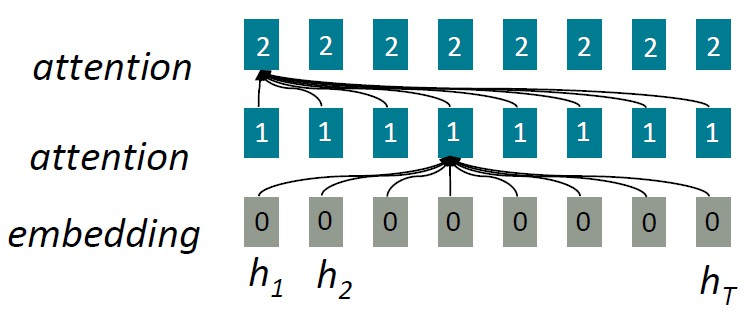

# Lecture 7

## From RNN to attention-based NLP models

### RNN issues

- linear locality
  - nearby words often affects each other's meanings
- problem
  - linear interaction distance
    - RNNs take **O(sequence length)** steps for distant word pairs to interact (e.g. _a chef who ... was ..._, there is a long distance between _chef_ and _was_)
    - hard to learn long-distance dependencies (gradient problems)
  - lack of parallelizability
    - 虽然GPU并行能力很强，但是RNN是按照时间顺序运行的，必须先算前一个词再算后一个词，并行能力很差
    - inhibits training on very large datasets

### Attention

- attention treats each word's representation as a **query** to access and incorporate information from **a set of values**
  - all words attend to all words in previous layer
  - number of unparallelizable operations does not increase sequence length
  - maximum interaction distance: O(1), since all words interact at every layer
  - 简单来说，就是每一层每个词和上一层所有词进行一次计算，这个计算是可以并行的；而层与层之间还是按照时间顺序

- 换一个角度，attention的工作有点像是在查表，我们现在有一个key-value的表，attention就像是提出一个query，来找到对应的key，从而得到value(左图)；只是实际上attention不会这么的离散，它的query和每个key都连着，只是根据权重来决定最后的输出(右图)

### Self-attention

- Keys, queries, values from the same sequence
  - let $(w_1, \dots, w_n)$ be a sequence of words in vocabulary _V_
  - for each $w_i$, let $x_i = E w_i$, where $E \in \mathbb{R}^{d \times |V|}$ is an embedding matrix (别忘了这里一个词向量的维度是d)
  - transform each word embedding with weight matrices Q,K,V, each in $\mathbb{R}^{d \times d}$
    - queries: $q_i = Q x_i$
    - keys: $k_i = K x_i$
    - values: $v_i = V x_i$
  - compute pairwise similarities between keys and queries; normalize with softmax
    - $e_{ij} = q_i^T k_j$
    - $\alpha_{ij} = \frac{exp(e_{ij})}{\sum_{j'}exp(e_{ij'})}$
  - compute output for each word as weighted sum of values
    - $o_i = \sum_j \alpha_{ij} v_i$
- Barriers and solutions
  1. doesn't have an inherent notion of order
       - 我们现在只是一层一层地堆self-attention，但是如果我们把这个句子的单词换一下顺序，是完全不影响结果的！因为我们到现在为止只是做了所有词与词之间的计算
       - sequence order
         - representing each **sequence index** as a **vector**
           - $p_i \in \mathbb{R}^d, i \in {1,2,\dots,n}$ are positive vectors that represent the index
         - just **add** $p_i$ to our inputs v, q and k! (do this at **the first layer**)
           - $\tilde{x}_i = x_i + p_i$
         - **sinusoidal position representations**: concatenate sinusoidal functions of varying periods
$$
p_i = \begin{bmatrix}
    sin(i/10000^{2*1/d}) \\
    cos(i/10000^{2*1/d}) \\
    \dotsc\\
    sin(i/10000^{2*\frac{d}{2}/d}) \\
    cos(i/10000^{2*\frac{d}{2}/d})
\end{bmatrix}
$$
           - periodically indicates that maybe "absolute position" isn't as important (一个词在某一个范围内起作用，所以或许精确的位置没那么重要，而且随着层数的增多，位置所起的作用越来越小)
           - maybe can extrapolate to longer sequences as periods restart
           - but it's not learnable!
         - **absolute position representations**: learn a matrix $p \in \mathbb{R}^{d \times n}$, and let $p_i$ be a column of that matrix
           - each position gets to be learned to fit the data
           - can't extrapolate to indices outside $1,\dots,n$
           - mostly used
  2. no nonlinearities for deep learning
       - stacking more self-attention layers just re-averages value vectors
       - add nonlinearities in self-attention
         - add a **feed-forward network** to post-process each output vector
$$
m_i = MLP(output_i) \\
    = W_2 \times ReLU (W_1 \times output_i + b_1) + b_2
$$
         - apply the same network to each self-attention network

  3. need to ensure we don't "look at the future" when predicting a sequence
       - 用decoder时我们要注意预测output只能根据其之前的词，之后的词是不能参考的，所以我们可以想办法把之后的词屏蔽掉
       - keeps information about the future from "leaking" to the past
       - **mask out attention** to future words by setting attention scores to $-\infty$
       - 这样写成矩阵形式以后，还可以继续做并行运算
$$
    e_{ij} = \left\{
        \begin{aligned}
            q_i^T k_j & & j \leq i \\
            -\infty & & j > i
        \end{aligned}
        \right.
$$

- what we get:

## Transformer

### Sequence-stacked form of attention

- how key-query-value attention is computed in matrices
- let $X = [x_1;\dots;x_n] \in \mathbb{R}^{n \times d}$ be the concatenation of input vectors
- note that $XK \in \mathbb{R}^{n \times d}$, $XQ \in \mathbb{R}^{n \times d}$, $XV \in \mathbb{R}^{n \times d}$
- the output is defined as $output = softmax(XQ(XK)^T)XV \in \mathbb{R}^{n \times d}$
  - $XQ(XK)^T$ is the previous $e_{ij}$ !

### Multi-headed attention

- 一般来说，self-attention会找到key*query最大的那个词作为output，但是如果我们对一个词有不同的需求，那么一个K,Q,V矩阵是不够的

- so we'll define **multiple attention "heads"** through multiple K,Q,V matrices
- let $Q_l,K_l,V_l \in \mathbb{R}^{d \times \frac{d}{h}},l = 1,\dots,h$, where $h$ is the number of attention heads
- each attention head performs attention independently
  - $output_l = softmax(XQ_l(XK_l)^T)XV_l \in \mathbb{R}^{n \times \frac{d}{h}}$
- the combine the output
  - $output = [output_1,\dots,output_h]Y$, where $Y \in \mathbb{R}^{d \times d}$
- each head gets to "look" at different things, and construct value vectors differently
- 这样做并不会增加额外的计算量，只是相当于把原来一个大矩阵拆成小份来算

### Residual Connections
  
- Residual connections are a trick to help models train better
- instead of $X^{(i)} = Layer(X^{(i-1)})$
- we let $X^{(i)} = X^{(i-1)} + Layer(X^{(i-1)})$, so we only have to learn "the residual" from the previous layer
  - gradient is great, it's 1! (without vanishing)

### Layer Normalization

- Layer normalization is a trick to help models train faster
- cutting down on uninformative variation in hidden vector values by normalizing to unit mean and standard deviation within each layer
- let $x \in \mathbb{R}^d$ be an individual vector in the model
- compute the mean $\mu = \sum_{j=1}^d x_j \in \mathbb{R}$
- compute the standard deviation $\sigma = \sqrt{\frac{1}{d} \sum_{j=1}^d(x_j-\mu)^2}$
- let $\gamma,\beta \in \mathbb{R}^d$ be learned "gain" and "bias" parameters
- $output = \frac{x-\mu}{\sqrt{\sigma}+\epsilon} \odot \gamma + \beta$
  - 这里都是元素与元素的运算
  - 分母加一个$\epsilon$防止标准差太小导致溢出

### Scaled Dot Product

- when dimensionality _d_ becomes large, dot products between vectors tend to become large
  - and inputs to the softmax function can be large, making the gradients small
- so we just divide the attention scores by $\sqrt{d/h}$:
$$
output_l = softmax(\frac{XQ_l(XK_l)^T}{\sqrt{d/h}})XV_l \in \mathbb{R}^{n \times \frac{d}{h}}
$$

### Cross-attention

- let $h_1, \dots, h_n \in \mathbb{R}^d$ be output vectors from the Transformer Encoder
- let $z_1, \dots, z_n \in \mathbb{R}^d$ be input vectors from the Transformer Decoder
- then keys and values are drawn from the **encoder** (like a memory)
  - $k_i = K h_i$, $v_i = V h_i$
- the queries are drawn from the **decoder**
  - $q_i = Q z_i$
- 简单来说就是decoder要用到encoder的信息，这里key和value都来自encoder，方程与self-attention是一样的

### Overall Structure

- The Transformer Decoder
  - Residual connections and Layer normalization are often written together as "Add & Norm"

- The Transformer Encoder
  - the only difference is that we **remove the masking** in the self-attention
  - decoder只能顺序输出，自然需要mask掉当前输出之后的词，但是encoder不用，就像bidirectional RNN一样，能直接看到所有的词，所以不用mask

- The Transformer Encoder-Decoder
  - a bidirectional encoder and a unidirectional decoder
  - we often use Transformer Encoder-Decoder for seq2seq format

## Great results with Transformers

- machine translation
- document generation
- pretraining ability
  - parallelizability allows for efficient pretraining

## Drawbacks and variants of Transformers

- Quadratic compute in self-attention
  - 因为要每两个词之间都计算一次，所以随着语句变长，我们的计算量是按平方增长的，也就是$O(n^2d)$
  - Linformer
    - map the sequence length dimension to a lower dimensional space for values, keys
  - almost no large Transformer language models use anything but the quadratic cost attention, so sometimes we find that most modifications do not meaningfully improve performance
- Position representation
  - relative linear position representation
  - dependency syntax-based position
